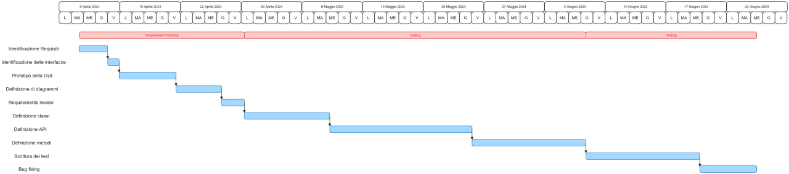

# Project Estimation - CURRENT
Date:

Version:

# Estimation approach
Consider the EZElectronics  project in CURRENT version (as given by the teachers), assume that you are going to develop the project INDEPENDENT of the deadlines of the course, and from scratch
# Estimate by size
### 
|             | Estimate                        |             
| ----------- | ------------------------------- |  
| NC =  Estimated number of classes to be developed   |                  6 Backend, 20 Frontend        |             
|  A = Estimated average size per class, in LOC       |            120 Backend, 50 Frontend              | 
| S = Estimated size of project, in LOC (= NC * A) | 720 Backend, 1000 Frontend|
| E = Estimated effort, in person hours (here use productivity 10 LOC per person hour)  |         172 ph                             |   
| C = Estimated cost, in euro (here use 1 person hour cost = 30 euro) | 5160 euro | 
| Estimated calendar time, in calendar weeks (Assume team of 4 people, 8 hours per day, 5 days per week ) |      1,1 settimane              |  

# Estimate by product decomposition
### 
|         component name    | Estimated effort (person hours)   |             
| ----------- | ------------------------------- | 
|requirement document    | 33 (1000 / (10 * 3))|
| GUI prototype |10|
|design document |40|
|code |200|
| unit tests |100|
| api tests |100|
| management documents  |10|

# Estimate by activity decomposition
### 
         
|         Activity name    | Estimated effort (person hours)   |             
| ----------- | ------------------------------- | 
|**Requirements planning**   | 29|
| Identificazione requisiti |5|
|Identificazione delle interfacce|2|
|Prototipo della GUI |10|
| Definizioni di diagrammi |8|
| Requirements review |4|
|**Coding**    | 60|
| Definizione classi |15|
|Definizione API |25|
|Definizione metodi |20|
| **Testing** |30|
| Scrittura dei test |20|
| Bug fixing | 10|

###
Insert here Gantt chart with above activities

# Summary

Report here the results of the three estimation approaches. The  estimates may differ. Discuss here the possible reasons for the difference

|             | Estimated effort                        |   Estimated duration |          
| ----------- | ------------------------------- | ---------------|
|1.  estimate by size |172ph| 1,1 week|
| 2. estimate by product decomposition |493ph|3 week|
| 3. estimate by activity decomposition |119ph|0,7 week|

L'estimate by size risulta 1,1 week poiché la stima viene effettuata considerando le linee di codice considerando 10 LOC per ph. 
La stima più alta è quella by product decomposition poiché vengono considerate le fasi di testing della web app.

