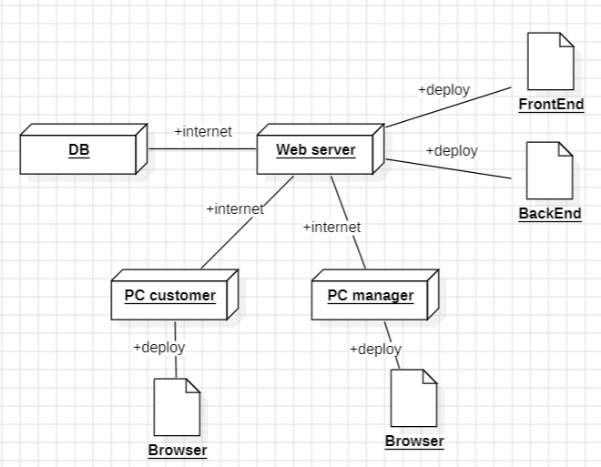

# Requirements Document - current EZElectronics

Date:

Version: V1 - description of EZElectronics in CURRENT form (as received by teachers)

| Version number | Change |
| :------------: | :----: |
|                |        |

# Contents

- [Requirements Document - current EZElectronics](#requirements-document---current-ezelectronics)
- [Contents](#contents)
- [Informal description](#informal-description)
- [Stakeholders](#stakeholders)
- [Context Diagram and interfaces](#context-diagram-and-interfaces)
  - [Context Diagram](#context-diagram)
  - [Interfaces](#interfaces)
- [Stories and personas](#stories-and-personas)
- [Functional and non functional requirements](#functional-and-non-functional-requirements)
  - [Functional Requirements](#functional-requirements)
  - [Table of Rights](#table-of-rights)
  - [Non Functional Requirements](#non-functional-requirements)
- [Use case diagram and use cases](#use-case-diagram-and-use-cases)
  - [Use case diagram](#use-case-diagram)
    - [Use case 1, Login](#use-case-1-login)
        - [Scenario 1.1](#scenario-11)
        - [Scenario 1.2](#scenario-12)
    - [Use case 2, Creazione di un nuovo prodotto](#use-case-2-creazione-di-un-nuovo-prodotto)
        - [Scenario 2.1, inserimento positivo di un singolo prodotto](#scenario-21-inserimento-positivo-di-un-singolo-prodotto)
        - [Scenario 2.2, inserimento negativo di prodotti](#scenario-22-inserimento-negativo-di-prodotti)
    - [Use case 3, Acquisto prodotto/i](#use-case-3-acquisto-prodottoi)
        - [Scenario 3.1, Acquisto effettuato correttamente](#scenario-31-acquisto-effettuato-correttamente)
        - [Scenario 3.2, Rimozione prodotto](#scenario-32-rimozione-prodotto)
        - [Scenario 3.3, Errore inserimento nel carrello, acquisto annullato](#scenario-33-errore-inserimento-nel-carrello-acquisto-annullato)
        - [Scenario 3.4, Errore inserimento nel carrello, acquisto confermato](#scenario-34-errore-inserimento-nel-carrello-acquisto-confermato)
    - [Use case 4, LogOut](#use-case-4-logout)
        - [Scenario 4.1, Successo Logout](#scenario-41-successo-logout)
        - [Scenario 4.2, Fallimento Logout](#scenario-42-fallimento-logout)
    - [Use case 5, Recupero informazioni utente loggato](#use-case-5-recupero-informazioni-utente-loggato)
        - [Scenario 5.1, Successo recupero informazioni personali](#scenario-51-successo-recupero-informazioni-personali)
        - [Scenario 5.2, Fallimento recupero informazioni personali](#scenario-52-fallimento-recupero-informazioni-personali)
    - [Use case 6, Creazione di un nuovo Utente/Manager](#use-case-6-creazione-di-un-nuovo-utentemanager)
        - [Scenario 6.1, Successo creazione nuovo account](#scenario-61-successo-creazione-nuovo-account)
        - [Scenario 6.2, Username già esistente](#scenario-62-username-già-esistente)
    - [Use case 7, Elenco di tutti gli utenti](#use-case-7-elenco-di-tutti-gli-utenti)
        - [Scenario 7.1, Successo recupero lista utenti](#scenario-71-successo-recupero-lista-utenti)
        - [Scenario 7.2, Fallimento recupero lista utenti](#scenario-72-fallimento-recupero-lista-utenti)
    - [Use case 8, Elenco tutti gli utenti con determinato ruolo](#use-case-8-elenco-tutti-gli-utenti-con-determinato-ruolo)
        - [Scenario 8.1, Successo recupero lista customers/managers](#scenario-81-successo-recupero-lista-customersmanagers)
    - [Use case 9, Recupera utente con determinato username](#use-case-9-recupera-utente-con-determinato-username)
        - [Scenario 9.1, Successo recupero Utente con username](#scenario-91-successo-recupero-utente-con-username)
        - [Scenario 9.2, Utente con username dato non presente in database](#scenario-92-utente-con-username-dato-non-presente-in-database)
    - [Use case 10, Eliminazione Utente con dato username](#use-case-10-eliminazione-utente-con-dato-username)
        - [Scenario 10.1, Successo rimozione Utente con username](#scenario-101-successo-rimozione-utente-con-username)
        - [Scenario 10.2, Utente con username dato non presente in database](#scenario-102-utente-con-username-dato-non-presente-in-database)
    - [Use case 11, Registrazione di prodotti con lo stesso modello](#use-case-11-registrazione-di-prodotti-con-lo-stesso-modello)
        - [Scenario 11.1, Inserimento corretto dei prodotti in catagolo](#scenario-111-inserimento-corretto-dei-prodotti-in-catagolo)
        - [Scenario 11.2, Inserimento errato della data di consegna](#scenario-112-inserimento-errato-della-data-di-consegna)
    - [Use case 12, Manager segna un prodotto come venduto](#use-case-12-manager-segna-un-prodotto-come-venduto)
        - [Scenario 12.1, Prodotto segnato come venduto](#scenario-121-prodotto-segnato-come-venduto)
        - [Scenario 12.2, Codice prodotto inserito errato](#scenario-122-codice-prodotto-inserito-errato)
        - [Scenario 12.3, Data vendita errata](#scenario-123-data-vendita-errata)
    - [Use case 13, Recupera prodotti presenti nel catalogo](#use-case-13-recupera-prodotti-presenti-nel-catalogo)
        - [Scenario 13.1, Lista di prodotti venduti](#scenario-131-lista-di-prodotti-venduti)
        - [Scenario 13.2, Lista di prodotti non venduti](#scenario-132-lista-di-prodotti-non-venduti)
    - [Use case 14, Recupera tutti i prodotti di una specifica categoria](#use-case-14-recupera-tutti-i-prodotti-di-una-specifica-categoria)
        - [Scenario 14.1, Lista di prodotti venduti](#scenario-141-lista-di-prodotti-venduti)
        - [Scenario 14.2, Lista di prodotti non venduti](#scenario-142-lista-di-prodotti-non-venduti)
    - [Use case 15, Recupera tutti i prodotti di uno specifico modello](#use-case-15-recupera-tutti-i-prodotti-di-uno-specifico-modello)
        - [Scenario 15.1, Lista di prodotti venduti](#scenario-151-lista-di-prodotti-venduti)
        - [Scenario 15.2, Lista di prodotti non venduti](#scenario-152-lista-di-prodotti-non-venduti)
    - [Use case 16, Elimina prodotto da catalogo](#use-case-16-elimina-prodotto-da-catalogo)
        - [Scenario 16.1, Prodotto rimosso con successo](#scenario-161-prodotto-rimosso-con-successo)
        - [Scenario 16.2, Codice prodotto fornito non presente in catalogo](#scenario-162-codice-prodotto-fornito-non-presente-in-catalogo)
    - [Use case 17, Recupera carrello di Customer attivo](#use-case-17-recupera-carrello-di-customer-attivo)
        - [Scenario 17.1, Lista di prodotti in carrello](#scenario-171-lista-di-prodotti-in-carrello)
    - [Use case 18, Aggiungi un prodotto al carrello](#use-case-18-aggiungi-un-prodotto-al-carrello)
        - [Scenario 18.1, Prodotto inserito con successo](#scenario-181-prodotto-inserito-con-successo)
        - [Scenario 18.2, Codice Prodotto inserito non in catalogo](#scenario-182-codice-prodotto-inserito-non-in-catalogo)
    - [Use case 19, Checkout carrello](#use-case-19-checkout-carrello)
        - [Scenario 19.1, Checkout avvenuto con successo](#scenario-191-checkout-avvenuto-con-successo)
        - [Scenario 19.2, Carrello vuoto al checkout](#scenario-192-carrello-vuoto-al-checkout)
    - [Use case 20, Recupero storico carrelli](#use-case-20-recupero-storico-carrelli)
        - [Scenario 20.1, Storico ordini](#scenario-201-storico-ordini)
    - [Use case 21, Rimozione prodotto da carrello](#use-case-21-rimozione-prodotto-da-carrello)
        - [Scenario 21.1, Successo rimozione prodotto](#scenario-211-successo-rimozione-prodotto)
        - [Scenario 21.2, Prodotto da rimuovere non presente nel carrello](#scenario-212-prodotto-da-rimuovere-non-presente-nel-carrello)
        - [Scenario 21.3, Carrello non attivo](#scenario-213-carrello-non-attivo)
        - [Scenario 21.4, Prodotto da rimuovere non presente nel catalogo](#scenario-214-prodotto-da-rimuovere-non-presente-nel-catalogo)
    - [Use case 22, Svuota carrello](#use-case-22-svuota-carrello)
        - [Scenario 22.1, Successo rimozione di tutti i Prodotti in carrello](#scenario-221-successo-rimozione-di-tutti-i-prodotti-in-carrello)
        - [Scenario 22.2, Customer non ha un carrello attivo](#scenario-222-customer-non-ha-un-carrello-attivo)
- [Glossary](#glossary)
- [System Design](#system-design)
- [Deployment Diagram](#deployment-diagram)

# Informal description

EZElectronics (read EaSy Electronics) is a software application designed to help managers of electronics stores to manage their products and offer them to customers through a dedicated website. Managers can assess the available products, record new ones, and confirm purchases. Customers can see available products, add them to a cart and see the history of their past purchases.

# Stakeholders

| Stakeholder name | Description |
| :--------------: | :---------: |
| Manager di un negozio di elettronica| Gestice l'inventario del negozio, inserisce nuovi ordini e monitora i prodotti |
| Customer | Usufruisce del software acquistando prodotti |
| Fornitori hardware | Riforniscono i magazzini del negozio evadendo gli ordini effettuati dai manager |

# Context Diagram and interfaces

## Context Diagram

## Interfaces

|   Actor   | Logical Interface | Physical Interface |
| :-------: | :---------------: | :----------------: |
| Manager | PC | GUI (inserire ordini e controllare disponibilità magazzino, visualizzare utenti e prodotti) |
| Customer | PC | GUI (acquistare prodotti, visualizzare utenti e prodotti) |

# Stories and personas
- Persona 1: studente, maschio, 19 anni, con un basso reddito
    - Storia: alla ricerca di un notebook economico, ma con buone prestazioni, per prendere appunti durante le lezioni. 

- Persona 2: professionista con un alto reddito, donna, single, età 40, senza figli
    - Storia: trascorrendo tutta la giornata al lavoro necessita di un elettrodomestico per la pulizia autonoma della casa (robo aspirapolvere).  

- Persona 3: professore universitario, uomo, età 35
    - Storia: per il proprio insegnamento ricerca arduino.

- Persona 4: adolescente, donna, 16 anni
    - Storia: è alla ricerca dell'ultimo modello di Iphone senza badare a spese.

- Persona 5: graphic designer, 26 anni, con un reddito medio
    - Storia: necessita di un computer ad alte prestazioni per il suo lavoro.

# Functional and non functional requirements

## Functional Requirements

|  ID   | Description |
| :---: | :---------: |
|  **FR1**  | **Autenticazione e autorizzazione** |
| FR1.1 | login/logout utente |
| FR1.2 | creazione account (con definizione del ruolo) |
| FR1.3 | cancellazione account |
| **FR2** | **Visualizzazione utenti iscritti** |
| FR2.1 | Recupero tutti gli utenti iscritti|
| FR2.2 | Recupero utenti per ruolo|
| FR2.3 | Recupero utente per username|
| **FR3**| **Gestione magazzino negozio**|
| FR3.1 | Registrazione arrivo di un set di prodotti dello stesso modello o di un singolo prodotto|
| FR3.1.1 | Creazione di un prodotto con id univoco|
| FR3.2 | Eliminazione di un singolo prodotto|
| FR3.3 | Registrazione vendita di un prodotto|
| **FR4** | **Visualizzazione prodotti (sia venduti, che disponibili)** |
| FR4.1 | Recupero tutti i prodotti|
| FR4.2 | Recupero prodotto per codice|
| FR4.3 | Recupero prodotti per categoria|
| FR4.4 | Recupero prodotti per modello|
| **FR5**| **Gestione carrello** |
| FR5.1 | Creazione automatica di un carrello |
| FR5.2 | Inserimento di un prodotto, se disponibile|
| FR5.3 | Rimozione di un prodotto |
| FR5.4 | Check-out di un carrello |
| FR5.4.1 | Salvataggio carrello evaso |
| FR5.5 | Eliminazione del carrello |
| **FR6**| **Visualizzazione utente** |
| FR6.1 | Informazione sessione |
| FR6.2 | Storico carrelli |

## Table of Rights

|      | **FR1** |  **FR2** | **FR3** | **FR4** |  **FR5** | **FR6** |
| :-------: | :---------------: | :----------------: | :-------: |   :-------: |   :-------: | :-------: | 
| Manager | X | X| X| X | | |
| Customer | X | X|  | X |X| X|

## Non Functional Requirements

|   ID    | Type (efficiency, reliability, ..) | Description | Refers to |
| :-----: | :--------------------------------: | :---------: | :-------: |
|  NFR1   | usabilità | I customer non devono aver bisogno di training | FR1, FR2, FR4, FR5 |
|  NFR2   | usabilità | Il tempo di training per un manager deve essere inferiore a 2 ore | FR3 |
|  NFR3   | efficienza| Il tempo di risposta ad ogni azione dell'utente deve essere inferiore di < 0.4 secondi (escludendo problemi di rete)| tutti gli FR|
|  NFR4   | affidabilità | Ogni utente non deve segnalare più di un bug all'anno| tutti gli FR |
| NFR5 | affidabilità | I server dove gira il software devono essere raggiungibili per il 95% delle ore annue | tutti gli FR|
| NFR6 | portabilità | L'applicazione web deve essere disponibile per i principali browser (Chromium-based , Firefox, Safari) | tutti gli FR |
| NFR7 | sicurezza | Deve implentare lo stato dell'arte attualmente disponibile | tutti gli FR 
| NFR8 | dominio | Le date devono essere rappresentate mediante il seguente formato: ***YYYY-MM-DD*** |  FR2, FR3, FR4
| NFR9 | dominio | I prodotti possono essere solo dei seguenti tipi: ***["Smartphone", "Laptop", "Appliance"]*** |  FR2, FR3, FR4

# Use case diagram and use cases

## Use case diagram

### Use case 1, Login

| Actors Involved  |  Customer, Manager                                                                    |
| :--------------: | :------------------------------------------------------------------: |
|   Precondition   | L'utente non ha effettuato l'accesso |
|  Post condition  |  L'utente risulta loggato   |
| Nominal Scenario |         Inserimento delle credenziali         |
|    Exceptions    |                        Credenziali errate                        |

##### Scenario 1.1

|  Scenario 1.1  |                                                                            |
| :------------: | :------------------------------------------------------------------------: |
|  Precondition  | L'utente non è loggato |
| Post condition |  L'utente risulta loggato   |
|     Step#      |                                Description                                 |
|       1        |                          L'utente accede alla pagina di login                                                   |
|       2        |                                                              L'utente inserisce le sue credenziali              |
| 3| L'utente è reindirizzato alla propria pagina personale|

##### Scenario 1.2 

|  Scenario 1.2  | Credenziali errate                                                                           |
| :------------: | :------------------------------------------------------------------------: |
|  Precondition  | L'utente non è loggato |
| Post condition |  L'utente non è loggato|
|     Step#      |                                Description                                 |
|       1        |                          L'utente accede alla pagina di login                                                   |
|       2        |                                                              L'utente inserisce le sue credenziali              |
| 3| Le credenziali risultano errate |
|4 | L'utente rimane sulla pagina di login e riceve un invito a verificare le credenziali|

### Use case 2, Creazione di un nuovo prodotto 

| Actors Involved  |                        Manager                                              | 
| :--------------: | :------------------------------------------------------------------: |
|   Precondition   | Il prodotto/i non è/sono presente/i in catalogo |
|  Post condition  | Il prodotto/i è/sono presente/i in catalogo  |
| Nominal Scenario |         Un manager inserisce un nuovo ordine|
|     Variants     |                      Possibile inserire un singolo prodotto o più prodotti dello stesso modello                      |
|    Exceptions    |                        Informazioni sull'ordine non corrette                        |

##### Scenario 2.1, inserimento positivo di un singolo prodotto

|  Scenario 2.1  |                                                                            |
| :------------: | :------------------------------------------------------------------------: |
|  Precondition  | Il prodotto non è in catalogo |
| Post condition |  Il prodotto è presente in catalogo   |
|     Step#      |                                Description                                 |
|       1        | Accesso alla pagina personale del manager|
|       2        | Inserimento dei paramentri del prodotto |
|      3       | Conferma inserimento del prodotto                                                                            |                                                                     |
##### Scenario 2.2, inserimento negativo di prodotti 

|  Scenario 2.2|                                                                            |
| :------------: | :------------------------------------------------------------------------: |
|  Precondition  | I prodotti non sono in catalogo |
| Post condition |  I prodotti non sono inseriti in catalogo   |
|     Step#      |                                Description                                 |
|       1        | Accesso alla pagina personale del manager|
|       2        | Inserimento dei paramentri dell'ordine |
|      3       | Messaggio di avviso per parametri errati|

### Use case 3, Acquisto prodotto/i

| Actors Involved  |              Customer                                                        |
| :--------------: | :------------------------------------------------------------------: |
|   Precondition   | Il/i prodotto/i sono in catagolo |
|  Post condition  |  I prodotti risultano venduti   |
| Nominal Scenario |         Il customer completa l'acquisto dei prodotti nel carrello         |
|    Exceptions    |                        Il prodotto è nel carrello attivo di un altro customer; Il customer non ha inserito prodotti nel carrello; alcuni prodotti nel carrello sono stati già venduti                        |

##### Scenario 3.1, Acquisto effettuato correttamente

|  Scenario 3.1  |                                                                            |
| :------------: | :------------------------------------------------------------------------: |
|  Precondition  | I prodotti sono in catalogo |
| Post condition |  I prodotti non sono presenti in catalogo   |
|     Step#      |                                Description                                 |
|       1        | Un customer fa login|
|       2        | Il customer inserisce i prodotti desiderati nel carrello|
|      3       | Il customer fa il checkout del carrello|
|      4       | I prodotti nel carrello sono rimossi dal catagolo|
|      5       | Il carrello è aggiunto allo storico dello user|

##### Scenario 3.2, Rimozione prodotto

|  Scenario 3.2  |                                                                            |
| :------------: | :------------------------------------------------------------------------: |
|  Precondition  | I prodotti sono in catalogo |
| Post condition |  I prodotti rimangono in catalogo |
|     Step#      |                                Description                                 |
|       1        | Un customer fa login|
|       2        | Il customer inserisce prodotti desiderati nel carrello|
|      3       | Il customer cambia idea su un prodotto|
|      4       | Il prodotto è rimosso dal carrello|

##### Scenario 3.3, Errore inserimento nel carrello, acquisto annullato

|  Scenario 3.3  |                                                                            |
| :------------: | :------------------------------------------------------------------------: |
|  Precondition  | I prodotti sono in catalogo |
| Post condition | Il catalogo rimane invariato |
|     Step#      |                                Description                                 |
|       1        | Un customer fa login|
|       2        | Il customer inserisce i prodotti desiderati nel carrello|
|       3        | Il customer cerca di inserire nel carrello un prodotto presente nel carrelo di un altro customer|
|       4        | Continua dallo step 3 dello scenario 3.2|

##### Scenario 3.4, Errore inserimento nel carrello, acquisto confermato

|  Scenario 3.4  |                                                                            |
| :------------: | :------------------------------------------------------------------------: |
|  Precondition  | I prodotti sono in catalogo |
| Post condition | Nel catalogo non sono più presenti i prodotti selezionati |
|     Step#      |                                Description                                 |
|       1        | Un customer fa login|
|       2        | Il customer inserisce i prodotti desiderati nel carrello|
|       3        | Il customer cerca di inserire nel carrello un prodotto presente nel carrelo di un altro customer|
|       4        | il customer ignora l'errore e seleziona un altro prodotto acquistabile|
|5|continua come da step 2 dello scenario 3.1|

### Use case 4, LogOut

| Actors Involved  |              Customer, Manager                                                        |
| :--------------: | :------------------------------------------------------------------: |
|   Precondition   |L'utente è loggato|
|  Post condition  |  L'utente non è più loggato|
| Nominal Scenario |         L'utente ha cliccato il bottone di LogOut|
|    Exceptions    | Fallimento logOut                        |

##### Scenario 4.1, Successo Logout

|  Scenario 4.1  |                                                                            |
| :------------: | :------------------------------------------------------------------------: |
|  Precondition  | L'utente è loggato|
| Post condition | L'utente non è più loggato|
|     Step#      |                                Description                                 |
|       1        | L'utente accede alla sua pagina personale|
|       2        | L'utente clicca il bottone di logout|
|       3        | L'utente fa logout con successo|

##### Scenario 4.2, Fallimento Logout

|  Scenario 4.2  |                                                                            |
| :------------: | :------------------------------------------------------------------------: |
|  Precondition  | L'utente è loggato|
| Post condition | L'utente è ancora loggato|
|     Step#      |                                Description                                 |
|       1        | L'utente accede alla sua pagina personale|
|       2        | L'utente clicca il bottone di logout|
|       3        | L'utente riceve un messaggio di errore e rimane logout|

### Use case 5, Recupero informazioni utente loggato

| Actors Involved  |              Customer, Manager                                                        |
| :--------------: | :------------------------------------------------------------------: |
|   Precondition   |L'utente è loggato|
|  Post condition  |  L'utente visualizza le proprie informazioni|
| Nominal Scenario |         L'utente vuole vedere il proprio profilo|
|    Exceptions    | L'utente non ha fatto il login                        |

##### Scenario 5.1, Successo recupero informazioni personali

|  Scenario 5.1  |                                                                            |
| :------------: | :------------------------------------------------------------------------: |
|   Precondition   |L'utente è loggato|
|  Post condition  |  L'utente visualizza le proprie informazioni|
|     Step#      |                                Description                                 |
|       1        | L'utente accede alla sua pagina personale|
|       2        | L'utente visualizza le proprie informazioni personali|

##### Scenario 5.2, Fallimento recupero informazioni personali

|  Scenario 5.1  |                                                                            |
| :------------: | :------------------------------------------------------------------------: |
|   Precondition   |L'utente è loggato|
|  Post condition  |  L'utente non riesce a visualizzare le proprie informazioni|
|     Step#      |                                Description                                 |
|       1        | L'utente accede alla sua pagina personale|
|       2        | L'utente visualizza un messaggio di errore|

### Use case 6, Creazione di un nuovo Utente/Manager

| Actors Involved  |              Customer, Manager                                                        |
| :--------------: | :------------------------------------------------------------------: |
|   Precondition   |L'utente non è registrato|
|  Post condition  |  L'utente è registrato|
| Nominal Scenario |         L'utente vuole creare un nuovo profilo|
|    Exceptions    | L'utente è già registrato|

##### Scenario 6.1, Successo creazione nuovo account

|  Scenario 6.1  |                                                                            |
| :------------: | :------------------------------------------------------------------------: |
|   Precondition   |L'utente non è registrato|
|  Post condition  |  L'utente è registrato|
|     Step#      |                                Description                                 |
|       1        | L'utente accede alla pagina HOME|
|       2        | L'utente clicca sul bottone 'Non sei ancora iscritto? Crea il tuo account'|
|       3        | L'utente inserisce le proprie credenziale e sceglie il ruolo|
|       4        | L'utente clicca 'Invio'|

##### Scenario 6.2, Username già esistente

|  Scenario 6.2  |                                                                            |
| :------------: | :------------------------------------------------------------------------: |
|   Precondition   |L'utente non è registrato|
|  Post condition  |  L'utente non è registrato|
|     Step#      |                                Description                                 |
|       1        | L'utente accede alla pagina HOME|
|       2        | L'utente clicca il bottone ''Non sei ancora iscritto? Crea il tuo account'|
|       3        | L'utente inserisce le proprie credenziale e sceglie il ruolo|
|       4        | L'utente clicca 'Invio'|
|       5        | Errore: "username già esistente", ricomincia da 3|

### Use case 7, Elenco di tutti gli utenti

| Actors Involved  |             Manager, Customer                                                        |
| :--------------: | :------------------------------------------------------------------: |
|   Precondition   ||
|  Post condition  |L'utente riceve la lista di tutti gli user|
| Nominal Scenario |         L'utente vuole la lista di tutti gli utenti|
|    Exceptions    | |

##### Scenario 7.1, Successo recupero lista utenti

|  Scenario 7.1  |                                                                            |
| :------------: | :------------------------------------------------------------------------: |
|   Precondition   ||
|  Post condition  |L'utente riceve la lista di tutti gli user|
|     Step#      |                                Description                                 |
|       1        |L'utente richiede la lista utente|
|       2        |L'utente riceve la lista utenti|

##### Scenario 7.2, Fallimento recupero lista utenti

|  Scenario 7.2  |                                                                            |
| :------------: | :------------------------------------------------------------------------: |
|   Precondition   ||
|  Post condition  |L'utente non riceve la lista di tutti gli user|
|     Step#      |                                Description                                 |
|       1        |L'utente richiede la lista utente|
|       2        |L'utente non riceve la lista utenti|

### Use case 8, Elenco tutti gli utenti con determinato ruolo

| Actors Involved  |             Customer, Manager                                                        |
| :--------------: | :------------------------------------------------------------------: |
|   Precondition   ||
|  Post condition  |L'utente riceve la lista di tutti gli user con ruolo fornito|
| Nominal Scenario |         L'utente vuole una lista dei clienti o una lista dei manager|
|    Exceptions    | |

##### Scenario 8.1, Successo recupero lista customers/managers

|  Scenario 8.1  |                                                                            |
| :------------: | :------------------------------------------------------------------------: |
|   Precondition   ||
|  Post condition  |Lo user riceve la lista di tutti i customer o managers|
|     Step#      |                                Description                                 |
|       1        |Lo user seleziona il ruolo a cui è interessato|
|       2        |Lo user riceve la lista di Customers/Managers|

### Use case 9, Recupera utente con determinato username

| Actors Involved  |             Customer, Manager                                                        |
| :--------------: | :------------------------------------------------------------------: |
|   Precondition   ||
|  Post condition  |L'utente riceve informazioni sull'utente che ha username selezionato|
| Nominal Scenario |         L'utente vuole i dati di un altro utente|
|    Exceptions    | Username fornito non presente nel database|

##### Scenario 9.1, Successo recupero Utente con username

|  Scenario 9.1  |                                                                            |
| :------------: | :------------------------------------------------------------------------: |
|   Precondition   ||
|  Post condition  |Lo user riceve informazioni sull'utente con username fornito|
|     Step#      |                                Description                                 |
|       1        |L'utente fornisce username|
|       2        |L'utente riceve informazioni su username dato|

##### Scenario 9.2, Utente con username dato non presente in database

|  Scenario 9.2  |                                                                            |
| :------------: | :------------------------------------------------------------------------: |
|   Precondition   ||
|  Post condition  |Lo user non riceve informazioni su user con username fornito|
|     Step#      |                                Description                                 |
|       1       |Lo user fornisce username|
|       2        |Lo user non riceve informazioni su username dato, errore 404|

### Use case 10, Eliminazione Utente con dato username

| Actors Involved  |             Customer, Manager                                                        |
| :--------------: | :------------------------------------------------------------------: |
|   Precondition   ||
|  Post condition  |L'utente con username fornito rimosso dal database|
| Nominal Scenario |         L'utente vuole rimuovere un utente|
|    Exceptions    | Username fornito non presente nel database|

##### Scenario 10.1, Successo rimozione Utente con username

|  Scenario 10.1  |                                                                            |
| :------------: | :------------------------------------------------------------------------: |
|   Precondition   ||
|  Post condition  |Utente con username fornito eliminato dal database|
|     Step#      |                                Description                                 |
|       1        |L'utente fornisce username|
|       2        |L'utente con username dato viene rimosso dal database|

##### Scenario 10.2, Utente con username dato non presente in database

|  Scenario 10.2  |                                                                            |
| :------------: | :------------------------------------------------------------------------: |
|   Precondition   ||
|  Post condition  |Nessuna modifica al database|
|     Step#      |                                Description                                 |
|       1        |L'utente fornisce username|
|       2        |L'utente riceve errore, username non presente in database|

### Use case 11, Registrazione di prodotti con lo stesso modello

| Actors Involved  |             Manager                                                        |
| :--------------: | :------------------------------------------------------------------: |
|   Precondition   |Manager ha fatto login|
|  Post condition  |Prodotti con lo stesso modello registrati in catagolo|
| Nominal Scenario |         Manager vuole registrare i nuovi prodotti arrivati|
|    Exceptions    | Data della consegna inserita successiva a data attuale|

##### Scenario 11.1, Inserimento corretto dei prodotti in catagolo

|  Scenario 11.1  |                                                                            |
| :------------: | :------------------------------------------------------------------------: |
|   Precondition   |Manager ha fatto login|
|  Post condition  |Nuovi prodotti in catalogo|
|     Step#      |                                Description                                 |
|       1       | Manager fa accesso alla pagina personale|
|       2        |Manager inserisce l'ordine|
|       3        |Nuovi prodotti inseriti |

##### Scenario 11.2, Inserimento errato della data di consegna

|  Scenario 11.2  |                                                                            |
| :------------: | :------------------------------------------------------------------------: |
|   Precondition   |Manager ha fatto login|
|  Post condition  |Prodotti non inseriti in catalogo|
|     Step#      |                                Description                                 |
|       1        | Manager fa accesso alla pagina personale|
|       2        |Manager inserisce l'ordine fornendo una data per la consegna dopo la data corrente|
|       3        |Manager riceve un errore|

### Use case 12, Manager segna un prodotto come venduto

| Actors Involved  |             Manager                                                        |
| :--------------: | :------------------------------------------------------------------: |
|   Precondition   |Manager ha fatto login|
|  Post condition  |Prodotto segnato come venduto, con 'Selling date' esistente|
| Nominal Scenario |         Manager aggiorna lo stato di un prodotto|
|    Exceptions    | Codice prodotto non esistente in catagolo, 'Selling date' inserita errata (dopo la data attuale o prima della data di consegna), Prodotto segnato come già venduto|

##### Scenario 12.1, Prodotto segnato come venduto 

|  Scenario 12.1  |                                                                            |
| :------------: | :------------------------------------------------------------------------: |
|   Precondition   |Manager ha fatto login|
|  Post condition  |prodotto segnato come venduto |
|     Step#      |                                Description                                 |
|       1        | Manager fa accesso alla pagina personale|
|       2        |Manager fornisce codice prodotto e data di vendita|
|       3        |Prodotto con codice fornito risulta venduto e data di vendita viene aggiornata|

##### Scenario 12.2, Codice prodotto inserito errato

|  Scenario 12.2  |                                                                            |
| :------------: | :------------------------------------------------------------------------: |
|   Precondition   |Manager ha fatto login|
|  Post condition  |Prodotto non segnato come venduto |
|     Step#      |                                Description                                 |
|       1        | Manager fa accesso alla pagina personale|
|       2        |Manager fornisce codice prodotto e data di vendita|
|       3        |Codice prodotto inserito non esistente in database, riceve errore|
|       4        |Riparti dal punto 2|

##### Scenario 12.3, Data vendita errata

|  Scenario 12.3  |                                                                            |
| :------------: | :------------------------------------------------------------------------: |
|   Precondition   |Manager ha fatto login|
|  Post condition  |Prodotto non segnato come venduto |
|     Step#      |                                Description                                 |
|       1        | Manager fa accesso alla pagina personale|
|       2        |Manager fornisce codice prodotto e data di vendita|
|       3        |Data di vendita precedente alla data di arrivo, errore|
|       4        |Riparti dal punto 2|

### Use case 13, Recupera prodotti presenti nel catalogo 

| Actors Involved  |             Manager, Customer                                                        |
| :--------------: | :------------------------------------------------------------------: |
|   Precondition   |L'utente ha fatto login|
|  Post condition  |L'utente riceve una lista di prodotti |
| Nominal Scenario |         L'utente vuole sapere i prodotti attualmente in catalogo non venduti|
|    Exceptions    | |

##### Scenario 13.1, Lista di prodotti venduti

|  Scenario 13.1  |                                                                            |
| :------------: | :------------------------------------------------------------------------: |
|   Precondition   |L'utente ha fatto login|
|  Post condition  |Lista di prodotti in catagolo venduti|
|     Step#      |                                Description                                 |
|       1        | L'utente richieda la lista di prodotti già venduti|
|       2       |L'utente riceve la lista di prodotti|

##### Scenario 13.2, Lista di prodotti non venduti

|  Scenario 13.2  |                                                                            |
| :------------: | :------------------------------------------------------------------------: |
|   Precondition   |L'utente ha fatto login|
|  Post condition  |Lista di prodotti in catagolo non venduti|
|     Step#      |                                Description                                 |
|       1        | L'utente richieda la lista di prodotti non venduti|
|       2        |L'utente riceve la lista di prodotti|

### Use case 14, Recupera tutti i prodotti di una specifica categoria 

| Actors Involved  |             Manager, Customer                                                        |
| :--------------: | :------------------------------------------------------------------: |
|   Precondition   |L'utente ha fatto login|
|  Post condition  |L'utente riceve la lista di prodotti |
| Nominal Scenario |         L'utente vuole sapere i prodotti di una determinata categoria attualmente in catalogo non venduti|
|    Exceptions    | |

##### Scenario 14.1, Lista di prodotti venduti

|  Scenario 14.1  |                                                                            |
| :------------: | :------------------------------------------------------------------------: |
|   Precondition   |L'utente ha fatto login|
|  Post condition  |Lista di prodotti venduti di una determinata categoria|
|     Step#      |                                Description                                 |
|       1        |L'utente richieda la lista di prodotti già venduti di una determinata categoria|
|       2        |L'utente riceve la lista di prodotti|

##### Scenario 14.2, Lista di prodotti non venduti

|  Scenario 14.2  |                                                                            |
| :------------: | :------------------------------------------------------------------------: |
|   Precondition   |L'utente ha fatto login|
|  Post condition  |Lista di prodotti non venduti di una determinata categoria|
|     Step#      |                                Description                                 |
|       1        | L'utente richiede la lista di prodotti non venduti di una determinata categoria|
|       2        |L'utente riceve la lista di oggetti|

### Use case 15, Recupera tutti i prodotti di uno specifico modello 

| Actors Involved  |             Manager, Customer                                                        |
| :--------------: | :------------------------------------------------------------------: |
|   Precondition   |L'utente ha fatto login|
|  Post condition  |L'utente riceve la lista di prodotti |
| Nominal Scenario |         L'utente vuole conoscere i prodotti di un determinato modello |
|    Exceptions    | |

##### Scenario 15.1, Lista di prodotti venduti

|  Scenario 15.1  |                                                                            |
| :------------: | :------------------------------------------------------------------------: |
|   Precondition   |L'utente ha fatto login|
|  Post condition  |Lista di prodotti venduti di  un determinato modello|
|     Step#      |                                Description                                 |
|       1        | L'utente richieda la lista di prodotti venduti di un determinato modello|
|       2        |L'utente riceve la lista di oggetti|

##### Scenario 15.2, Lista di prodotti non venduti

|  Scenario 15.2  |                                                                            |
| :------------: | :------------------------------------------------------------------------: |
|   Precondition   |L'utente ha fatto login|
|  Post condition  |Lista di prodotti non venduti di un determinato modello|
|     Step#      |                                Description                                 |
|       1        | L'utente richieda la lista di prodotti non venduti di un determinato modello|
|       2        |L'utente riceve la lista di oggetti|

### Use case 16, Elimina prodotto da catalogo

| Actors Involved  |             Manager                                                        |
| :--------------: | :------------------------------------------------------------------: |
|   Precondition   |Manager ha fatto login|
|  Post condition  |Prodotto rimosso da catalogo|
| Nominal Scenario |         Manager vuole eliminare un prodotto |
|    Exceptions    | Codice prodotto inserito non presente nel catalogo|

##### Scenario 16.1, Prodotto rimosso con successo

|  Scenario 16.1  |                                                                            |
| :------------: | :------------------------------------------------------------------------: |
|   Precondition   |Manager ha fatto login|
|  Post condition  |Prodotto con codice dato non più presente in catalogo|
|     Step#      |                                Description                                 |
|       1        | Manager ricerca il prodotto da eliminare attraverso l'apposita barra|
|       2        | Manager richiede la rimozione del prodotto|
| 3 | Manager conferma |
|       4        | Prodotto rimosso dal catalogo |

### Use case 17, Recupera carrello di Customer attivo

| Actors Involved  |             Customer                                                        |
| :--------------: | :------------------------------------------------------------------: |
|   Precondition   |Customer ha fatto login|
|  Post condition  |Lista di oggetti nel carrello del Customer|
| Nominal Scenario |         Customer vuole vedere i prodotti nel carrello|
|    Exceptions    ||

##### Scenario 17.1, Lista di prodotti in carrello

|  Scenario 17.1  |                                                                            |
| :------------: | :------------------------------------------------------------------------: |
|   Precondition   |Customer ha fatto login|
|  Post condition  |Lista di prodotti nel carrello|
|     Step#      |                                Description                                 |
|       1        | Customer fa accesso alla sezione 'Carello'|

### Use case 18, Aggiungi un prodotto al carrello

| Actors Involved  |             Customer                                                        |
| :--------------: | :------------------------------------------------------------------: |
|   Precondition   |Customer ha fatto login|
|  Post condition  |Carrello aggiornato con il nuovo prodotto|
| Nominal Scenario |         Customer vuole aggiungere un prodotto nel carrello|
|    Exceptions    |Codice prodotto non esistente in catalogo, prodotto già presente in un altro carrello, prodotto già venduto|

##### Scenario 18.1, Prodotto inserito con successo

|  Scenario 18.1  |                                                                            |
| :------------: | :------------------------------------------------------------------------: |
|   Precondition   |Customer ha fatto login|
|  Post condition  |Carrello aggiornato con il nuovo prodotto|
|     Step#      |                                Description                                 |
|       1        | Customer fa accesso alla sezione 'CARRELLO'|
|       2        | Customer inserisce il prodotto nel carrello|
|       3        | Prodotto inserito correttamente |

##### Scenario 18.2, Codice Prodotto inserito non in catalogo

|  Scenario 18.2  |                                                                            |
| :------------: | :------------------------------------------------------------------------: |
|   Precondition   |Customer ha fatto login|
|  Post condition  |Lista di oggetti in carrello non aggiornato con Prodotto|
|     Step#      |                                Description                                 |
|       1        | Customer fa accesso alla sezione 'CARRELLO'|
|       2        | Customer inserisce codice prodotto|
|       3        | Customer riceve un errore|
|       4        | Customer riparte da punto 2|

### Use case 19, Checkout carrello

| Actors Involved  |             Customer                                                        |
| :--------------: | :------------------------------------------------------------------: |
|   Precondition   |Customer ha fatto login|
|  Post condition  |Carrello confermato|
| Nominal Scenario |         Customer vuole fare il checkout del carrello|
|    Exceptions    |Il carrello è vuoto o il customer non ha un carrello attivo|

##### Scenario 19.1, Checkout avvenuto con successo

|  Scenario 19.1  |                                                                            |
| :------------: | :------------------------------------------------------------------------: |
|   Precondition   |Customer ha fatto login|
|  Post condition  |Carrello confermato |
|     Step#      |                                Description                                 |
|       1        | Customer fa accesso alla sezione 'CARRELLO'|
|       2        | Customer preme il pulsante 'CHECKOUT'|
|       3        | Customer procede alla conferma dell'ordine|

##### Scenario 19.2, Carrello vuoto al checkout

|  Scenario 19.2  |                                                                            |
| :------------: | :------------------------------------------------------------------------: |
|   Precondition   |Customer ha fatto login|
|  Post condition  |Carrello non confermato |
|     Step#      |                                Description                                 |
|       1        | Customer fa accesso alla sezione 'CARRELLO'|
|       2        | Customer preme il pulsante 'CHECKOUT'|
|       3        | Customer riceve un errore perchè il carrello è vuoto|
|       4        | Riparti da 2|

### Use case 20, Recupero storico carrelli

| Actors Involved  |             Customer                                                        |
| :--------------: | :------------------------------------------------------------------: |
|   Precondition   |Customer ha fatto login|
|  Post condition  |Lista di carrelli confermati|
| Nominal Scenario |         Il customer vuole vedere la lista di carrelli confermati|
|    Exceptions    ||

##### Scenario 20.1, Storico ordini

|  Scenario 20.1  |                                                                            |
| :------------: | :------------------------------------------------------------------------: |
|   Precondition   |Customer ha fatto login|
|  Post condition  |Lista di carrelli confermati|
|     Step#      |                                Description                                 |
|       1        | Customer fa accesso al profilo|
|       2        | Visualizza lo storico dei carrelli|

### Use case 21, Rimozione prodotto da carrello

| Actors Involved  |             Customer                                                        |
| :--------------: | :------------------------------------------------------------------: |
|   Precondition   |Customer ha fatto login|
|  Post condition  |Prodotto rimosso dal carello |
| Nominal Scenario |         Il customer non desidera più comprare quel prodotto|
|    Exceptions    |Codice prodotto non nel carrello, carrello non attivo, codice prodotto non presente nel catalogo|

##### Scenario 21.1, Successo rimozione prodotto 

|  Scenario 21.1  |                                                                            |
| :------------: | :------------------------------------------------------------------------: |
|   Precondition   |Customer ha fatto login|
|  Post condition  |Prodotto rimosso dal carello |
|     Step#      |                                Description                                 |
|       1        | Il customer fa accesso alla sezione 'CARRELLO'|
|       2        | Il customer clicca sul bottone per rimuovere il prodotto|
|       3        | Prodotto rimosso da carrello |

##### Scenario 21.2, Prodotto da rimuovere non presente nel carrello

|  Scenario 21.2  |                                                                            |
| :------------: | :------------------------------------------------------------------------: |
|   Precondition   |Customer ha fatto login|
|  Post condition  |Prodotto non rimosso da carello |
|     Step#      |                                Description                                 |
|       1        | Il customer fa accesso alla sezione 'CARRELLO'|
|       2        | Il customer clicca sul bottone per rimuovere il prodotto|
|       3        | Prodotto non presente nel carrello, il customer riceve un errore|
|       4        | Riparti da 2|

##### Scenario 21.3, Carrello non attivo

|  Scenario 21.3  |                                                                            |
| :------------: | :------------------------------------------------------------------------: |
|   Precondition   |Customer ha fatto login|
|  Post condition  |Prodotto non rimosso da carello |
|     Step#      |                                Description                                 |
|       1        | Il customer fa accesso alla sezione 'CARRELLO'|
|       2        | Il customer clicca sul bottone per rimuovere il prodotto|
|       3        | Il carrello del customer non è attivo, riceve un errore|
|       4        | Riparti da 2|

##### Scenario 21.4, Prodotto da rimuovere non presente nel catalogo

|  Scenario 21.4  |                                                                            |
| :------------: | :------------------------------------------------------------------------: |
|   Precondition   |Customer ha fatto login|
|  Post condition  |Prodotto non rimosso da carello |
|     Step#      |                                Description                                 |
|       1        | Il customer fa accesso alla sezione 'CARRELLO'|
|       2        | Il customer clicca sul bottone per rimuovere il prodotto|
|       3        | Prodotto non presente in catalogo, il customer riceve un errore|
|       4        | Riparti da 2|

### Use case 22, Svuota carrello

| Actors Involved  |             Customer                                                        |
| :--------------: | :------------------------------------------------------------------: |
|   Precondition   |Customer ha fatto login|
|  Post condition  |Carrello vuoto |
| Nominal Scenario |         Il customer vuole svuotare il carrello |
|    Exceptions    |Il customer non ha un carrello attivo |

##### Scenario 22.1, Successo rimozione di tutti i Prodotti in carrello

|  Scenario 22.1  |                                                                            |
| :------------: | :------------------------------------------------------------------------: |
|   Precondition   |Customer ha fatto login|
|  Post condition  |Carrello vuoto |
|     Step#      |                                Description                                 |
|       1        | Customer fa accesso alla sezione 'CARRELLO'|
|       2        | Customer preme pulsante 'SVUOTA CARRELLO'|
|       3        | Tutti i prodotti nel carrello vengono rimossi|

##### Scenario 22.2, Customer non ha un carrello attivo

|  Scenario 22.2  |                                                                            |
| :------------: | :------------------------------------------------------------------------: |
|   Precondition   |Il customer ha fatto login|
|  Post condition  |Carrello vuoto |
|     Step#      |                                Description                                 |
|       1        | Customer fa accesso alla sezione 'CARRELLO'|
|       2        | Customer preme pulsante 'SVUOTA CARRELLO'|
|       3        | Customer riceve un errore perchè il carrello non è attivo|
|       4        | Riparti dal punto 2|

# Glossary

- Utente
  - caratterizzato da uno username
  - colui che beneficia dei servizi dell'applicazione
  - non rappresenta una persona reale, ma un fruitore del servizio, che può essere una persona, un negozio, ...
  - può avere un ruolo di Custumer o di Manager
  
  - Manager
    - ha il potere di inserire nuovi prodotti;
    - può verificare la presenza e le caratteristiche di tutti i prodotti
    - può segnare come venduto un prodotto
  
  - Customer
    - può vedere i prodotti disponibili
    - può aggiungere prodotti al suo carrello
    - può accedere allo storico dei suoi acquisti

- Acquisto
  - Un acquisto è lo scambio di uno o più prodotti tra un gestore e un cliente, mediato dall'applicazione
  - per effettuare un acquisto, i prodotti vanno aggiunti ad un carrello
  - la transazione si conclude con il ritiro, in negozio, ed il pagamento da parte del customer delle merce ordinata

- Prodotto
  - un prodotto è una qualsiasi merce scambiata attraverso l'applicazione
  - un prodotto ha un prezzo, che rappresenta il suo valore
  - un prodotto è definito da un codice univoco
  - i prodotti sono espressioni di uno specifico modello
  - ogni prodotto appartiene ad una categoria (***"Smartphone", "Laptop", "Appliance"***)

- Carrello
  - ogni cliente possiede un proprio carrello nel momento in cui ha prodotti inseriti
  - il carrello memorizza le informazioni dei prodotti richiesti da un cliente: il suo contenuto può essere modificato dal cliente 
  - in ogni momento un cliente può richiedere la conferma del carrello
  - per ogni clente è memorizzata una lista di carrelli passati, ovvero per i quali  ha effetuato il check-out

# System Design

# Deployment Diagram

