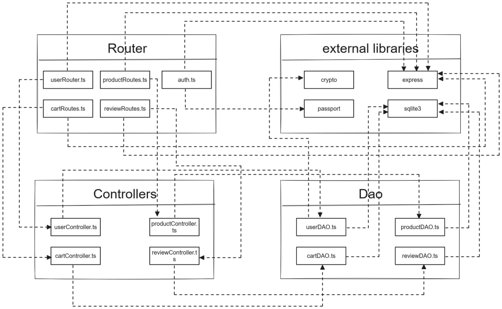

# Test Report

<!--The goal of this document is to explain how the application was tested, detailing how the test cases were defined and what they cover-->

# Contents

- [Test Report](#test-report)
- [Contents](#contents)
- [Dependency graph](#dependency-graph)
- [Integration approach](#integration-approach)
- [Tests](#tests)
  - [unit tests](#unit-tests)
    - [dao tests](#dao-tests)
    - [controller tests](#controller-tests)
    - [routes tests](#routes-tests)
  - [integration tests](#integration-tests)
- [Coverage](#coverage)
  - [Coverage of FR](#coverage-of-fr)
  - [Coverage white box](#coverage-white-box)

# Dependency graph

# Integration approach

Abbiamo seguito un approccio *bottom up* per i nostri test, iniziando dagli unit test fino a integrazione. Ogni membro del team si è concentrato su una sezione del codice (user, product, review e cart) e alla fine delle fase di scrittura del codice ci siamo occupati dei rispettivi test.

  1. step: unit testing
    - step 1.1: unit testing DAO per user, product, review e cart
    - step 1.2: unit testing controller per user, product, review e cart
    - step 1.3: unit testing routes per user, product, review e cart
  2. step: integration testing
    - step 2.1: review.test.ts
    - step 2.2: product.test.ts
    - step 2.3: user.test.ts
    - step 2.3: cart.test.ts

# Tests

<!--n the table below list the test cases defined For each test report the object tested, the test level (API, integration, unit) and the technique used to define the test case (BB/ eq partitioning, BB/ boundary, WB/ statement coverage, etc)> <split the table if needed-->

## unit tests

### dao tests

| Test case name | Object(s) tested | Test level | Technique used |
| :------------: | :--------------: | :--------: | :------------: |
|**create user**|
|create user, return true|userDAO.createUser|unit|WB/statement coverage|
|Create user, Username Duplication|userDAO.createUser|unit|WB/statement coverage|
|create user, database error|userDAO.createUser|unit|WB/statement coverage|
|Create user, generic error|userDAO.createUser|unit|WB/statement coverage|
|**getIsUserAuthenticated**|
|getIsUserAuthenticated, should resolve true|userDAO.getIsUserAuthenticated|unit|WB/statement coverage|
|test false per getIsUserAuthenticated|userDAO.getIsUserAuthenticated|unit|WB/statement coverage|
|getIsUsserAuthenticated, generic error|userDAO.getIsUserAuthenticated|unit|WB/statement coverage|
|**getUserByUsername**|
|getUserByUsername, All good|userDAO.getUserByUsername|unit|WB/statement coverage|
|getUserByUsername, database error|userDAO.getUserByUsername|unit|WB/statement coverage|
|getUserByUsername, UserNotFound|userDAO.getUserByUsername|unit|WB/statement coverage|
|getUserByUsername, generic error|userDAO.getUserByUsername|unit|WB/statement coverage|
|**updateUserInfo**|
|updateUserInfo, All good|userDAO.updateUserInfo|unit|WB/statement coverage|
|updateUserInfo, UserNotFound|userDAO.updateUserInfo|unit|WB/statement coverage|
|updateUserInfo, otherChangingAdmin|userDAO.updateUserInfo|unit|WB/statement coverage|
|updateUserInfo, database error|userDAO.updateUserInfo|unit|WB/statement coverage|
|updateUserInfo, no changes|userDAO.updateUserInfo|unit|WB/statement coverage|
|**getAllUsers**|
|getAllUsers, All good|userDAO.getAllUsers|unit|WB/statement coverage|
|getAllUsers, database error|userDAO.getAllUsers|unit|WB/statement coverage|
|getAllUsers, general error|userDAO.getAllUsers|unit|WB/statement coverage|
|**getUsersByRole**|
|getUsersByRole, All good|userDAO.getUsersByRole|unit|WB/statement coverage|
|getUsersByRole, database error|userDAO.getUsersByRole|unit|WB/statement coverage|
|getUsersByRole, generic error|userDAO.getUsersByRole|unit|WB/statement coverage|
|**deleteUser**|
|deleteUser, All good|userDAO.deleteUser|unit|WB/statement coverage|
|deleteUser, database error|userDAO.deleteUser|unit|WB/statement coverage|
|deleteUser, isAdmin|userDAO.deleteUser|unit|WB/statement coverage|
|deleteuser, generic error|userDAO.deleteUser|unit|WB/statement coverage|
|**deleteAll**|
|deleteAll, All good|userDAO.deleteAll|unit|WB/statement coverage|
|deleteAll, database error|userDAO.deleteAll|unit|WB/statement coverage|
|deleteAll, generic error|userDAO.deleteAll|unit|WB/statement coverage|
|    |    |     |   |
| **AddReview**               |                  |            |                |
| testing positive outcome              |          reviewDAO      |            unit| WB/statement coverage                |
| testing missing model, it should return an error             |          reviewDAO|            unit| WB/statement coverage                |
| testing missing user, it should return an error             |          reviewDAO|            unit| WB/statement coverage                |
| generic error from query GET exection             |          reviewDAO|            unit| WB/statement coverage                |
| generic error from query RUN execution             |          reviewDAO|            unit| WB/statement coverage                |
| testing if a user has bought the product its reviewing, if not it should return an error             |          reviewDAO|            unit| WB/statement coverage                |
| **getProductReviews** | | ||
| testing positive outcome, it should return an array of reviews             |          reviewDAO|            unit| WB/statement coverage                |
| generic error from query ALL execution             |          reviewDAO|            unit| WB/statement coverage                |
| **deleteProductReview** | | ||
| testing positive outcome             |          reviewDAO|            unit| WB/statement coverage                |
| testing missing model, it should return an error             |          reviewDAO|            unit| WB/statement coverage                |
| testing if a review on the model exists, if not it should return an error             |          reviewDAO|            unit| WB/statement coverage                |
| generic error from query GET execution             |          reviewDAO|            unit| WB/statement coverage                |
| generic error from query RUN execution             |          reviewDAO|            unit| WB/statement coverage                |
| **deleteReviewsOfProduct** | | ||
| testing positive outcome             |          reviewDAO|            unit| WB/statement coverage                |
| testing missing model, it should return an error             |          reviewDAO|            unit| WB/statement coverage                |
| testing if a product has at least one review to be deleted             |          reviewDAO|            unit| WB/statement coverage                |
| generic error from query GET execution             |          reviewDAO|            unit| WB/statement coverage                |
| generic error from query RUN execution             |          reviewDAO|            unit| WB/statement coverage                |
| **deleteAllReviews** | | ||
| testing positive outcome             |          reviewDAO|            unit| WB/statement coverage                |
| it should be at least one review             |          reviewDAO|            unit| WB/statement coverage                |
| generic error from query GET execution             |          reviewDAO|            unit| WB/statement coverage                |
| generic error from query RUN execution             |          reviewDAO|            unit| WB/statement coverage                |
| **verificaVenditaProdotto** | | ||
| testing positive outcome             |          reviewDAO|            unit| WB/statement coverage                |
| testing getOrdersFromCart failure             |          reviewDAO|            unit| WB/statement coverage                |
| testing getOrdersFromCart failure             |          reviewDAO|            unit| WB/statement coverage                |
| testing getPastCarts failure             |          reviewDAO|            unit| WB/statement coverage                |
| testing getUserByUsername failure             |          reviewDAO|            unit| WB/statement coverage                |
|    |    |     |   |
**registerProducts**               |                  |            |                |
| test product insertion successful | productDAO | unit| WB/statement coverage |
| test error: product already inserted | productDAO| unit| WB/statement coverage |
| test error: generic error during query execution | productDAO| unit| WB/statement coverage |
**getProducts**               |                  |            |                |
| test no product in stock | productDAO | unit | WB/statement coverage |
| test successful product stock display | productDAO | unit | WB/statement coverage |
| test successful display of products in a specific category | productDAO | unit | WB/statement coverage |
| test insertion of non-existent category | productDAO | unit | WB/statement coverage |
| test no product in stock in a specific category | productDAO | unit | WB/statement coverage |
| test successful display of products of a specific model | productDAO | unit | WB/statement coverage |
| test product not found | productDAO | unit | WB/statement coverage |
| test no product in stock of a specific model | productDAO | unit | WB/statement coverage |
**deleteProduct**               |                  |            |                |
| test successful product deletion | productDAO | unit | WB/statement coverage |
**deleteAllProducts**               |                  |            |                |
| test successful deletion of all products | productDAO | unit | WB/statement coverage |
| test error: generic error during query execution | productDAO | unit | WB/statement coverage |
**getAvailableProducts**               |                  |            |                |
| test no product with quantity >0 available | productDAO | unit | WB/statement coverage |
| test successful display of products with quantity >0 | productDAO | unit | WB/statement coverage |
| test successful display of products in a specific category with quantity >0 | productDAO | unit | WB/statement coverage |
| test no product in a specific category with quantity >0 | productDAO | unit | WB/statement coverage |
| test successful display of products of a specific model with quantity >0 | productDAO | unit | WB/statement coverage |
| test no product of a specific model with quantity >0 | productDAO | unit | WB/statement coverage |
| test insertion of non-existent category | productDAO | unit | WB/statement coverage |
| test product not found | productDAO | unit | WB/statement coverage |
**sellProduct**               |                  |            |                |
| test successful sale of a product with a non-null date | productDAO | unit | WB/statement coverage |
| test successful sale of a product with a null date | productDAO | unit | WB/statement coverage |
| test stock less than quantity to sell | productDAO | unit | WB/statement coverage |
| test purchase date earlier than arrival date | productDAO | unit | WB/statement coverage |
| test purchase date later than today's date | productDAO | unit | WB/statement coverage |
| test successful sale of a product with a non-null date | productDAO | unit | WB/statement coverage |
**changeProductQuantity**               |                  |            |                |
| test successful change of quantity of a product with a non-null date | productDAO | unit | WB/statement coverage |
| test successful change of quantity of a product with a null date | productDAO | unit | WB/statement coverage |
| test new date earlier than arrival date | productDAO | unit | WB/statement coverage |
| test new date later than today's date | productDAO | unit | WB/statement coverage |
| test error: generic error during query execution | productDAO | unit | WB/statement coverage |
|    |    |     |   |
|**Suite di test per la funzione addProduct** (add product to unpaid cart and errors)| CartDAO | unit| WB/path coverage|
|**Suite di test per la funzione getActiveCart** (get unpaid cart or create it and errors)| CartDAO | unit| WB/path coverage|
|**Suite di test per la funzione getCurrentCart** (get unpaid cart with product and errors)| CartDAO | unit| WB/path coverage|
|**Suite di test per la funzione getExistingCart** (get unpaid cart and errors)| CartDAO | unit| WB/path coverage|
|**Suite di test per la funzione checkoutCart** (check-out unpaid cart and errors)| CartDAO | unit| WB/path coverage|
|**Suite di test per la funzione removeProduct** (remove product from unpaid cart and errors)| CartDAO | unit| WB/path coverage|
|**Suite di test per la funzione removeCart** (remove unpaid cart and errors)| CartDAO | unit| WB/path coverage|
|**Suite di test per la funzione getPastCarts** (retrieve paid carts for a customer and errors)| CartDAO | unit| WB/path coverage|
|**Suite di test per la funzione getOrdersForCart** (retrieve products for a cart and errors)| CartDAO | unit| WB/path coverage|
|**Suite di test per la funzione getAllCarts** (retrieve all carts and errors)| CartDAO | unit| WB/path coverage|
|**Suite di test per la funzione deleteAllCarts** (delete all carts and errors)| CartDAO | unit| WB/path coverage|
|**Suite di test per la funzione deleteOrdersForProduct** (updates the total of unpaid carts and errors)| CartDAO | unit| WB/path coverage|
|**Suite di test per la funzione verificaProdotto** (verify product existence and errors)| CartDAO | unit| WB/path coverage|
|**Suite di test per la funzione manageProductInCart** (manage product quantity of unpaid carts and errors)| CartDAO | unit| WB/path coverage|

### controller tests

| Test case name | Object(s) tested | Test level | Technique used |
| :------------: | :--------------: | :--------: | :------------: |
|createUser, should return true|controller.createUser|unit|WB/statement coverage|
|getUsers, should return true|controller.getUsers|unit|WB/statement coverage|
|getUsersByRole, should return true|controller.getUsersByRole|unit|WB/statement coverage|
|getUserByUsername, all good|controller.getUserByUsername|unit|WB/statement coverage|
|getUserByUsername, not same username|controller.getUserByUsername|unit|WB/statement coverage|
|deleteUser, all good|controller.deleteUser|unit|WB/statement coverage|
|deleteUser, no same user|controller.deleteUser|unit|WB/statement coverage|
|deleteAll, all good|controller.deleteAll|unit|WB/statement coverage|
|updateUserInfo, all good|controller.updateUserInfo|unit|WB/statement coverage|
|updateUserInfo, notSameUser|controller.updateUserInfo|unit|WB/statement coverage|
|updateUserInfo, birthdayError|controller.updateUserInfo|unit|WB/statement coverage|
|checkSameUser, all good|controller.checkSameUser|unit|WB/statement coverage|
|checkSameUser, not same user, not admin|controller.checkSameUser|unit|WB/statement coverage|
|checkSameUser, not same user, is admin|controller.checkSameUser|unit|WB/statement coverage|
|    |    |     |   |
|addReview |ReviewController|unit|WB/statement coverage|
|getProductReviews |ReviewController|unit|WB/statement coverage|
|deleteReview |ReviewController|unit|WB/statement coverage|
|deleteReviewsOfProduct |ReviewController|unit|WB/statement coverage|
|deleteAllReviews |ReviewController|unit|WB/statement coverage|
|    |    |     |   |
|registerProducts |ProductController|unit|WB/statement coverage|
|changeProductQuantity |ProductController|unit|WB/statement coverage|
|sellProduct |ProductController|unit|WB/statement coverage|
|getProducts |ProductController|unit|WB/statement coverage|
|getAvailableProducts |ProductController|unit|WB/statement coverage|
|deleteAllProducts |ProductController|unit|WB/statement coverage|
|deleteProduct |ProductController|unit|WB/statement coverage|
|    |    |     |   |
|Suite di test per la funzione addToCart|CartController|unit|WB/path coverage|
|Suite di test per la funzione getCart|CartController|unit|WB/path coverage|
|Suite di test per la funzione checkoutCart|CartController|unit|WB/path coverage|
|Suite di test per la funzione getCustomerCarts|CartController|unit|WB/path coverage|
|Suite di test per la funzione removeProductFromCart|CartController|unit|WB/path coverage|
|Suite di test per la funzione clearCart|CartController|unit|WB/path coverage|
|Suite di test per la funzione deleteAllCarts|CartController|unit|WB/path coverage|
|Suite di test per la funzione getAllCarts|CartController|unit|WB/path coverage|

### routes tests

| Test case name | Object(s) tested | Test level | Technique used |
| :------------: | :--------------: | :--------: | :------------: |
|**POST /ezelectronics/users/**|
|POST /ezelectronics/users/, should return a 200 success code|post(/ezelectronics/users/")|unit|WB/statement coverage|
|POST /ezelectronics/users/, should return a 409 error code|post("/ezelectronics/users/")|unit|WB/statement coverage|
|POST /ezelectronics/users/, should return a 422 error code|post("/ezelectronics/users/")|unit|WB/statement coverage|
|POST /ezelectronics/users/, should return a 503 error code|post("/ezelectronics/users/")|unit|WB/statement coverage|
|**GET /ezelectronics/users/**|
|GET /ezelectronics/users/, should return a 200 success code|get("/ezelectronics/users/")|unit|WB/statement coverage|
|GET /ezelectronics/users/, should return a 503 error code|get("/ezelectronics/users/")|unit|WB/statement coverage|
|GET /ezelectronics/users/, should return a 401 error code|get("/ezelectronics/users/")|unit|WB/statement coverage|
|**GET /ezelectronics/users/roles/:role/**|
|GET /ezelectronics/users/roles/:role/, should return a 200 success code|get("/ezelectronics/users/roles/Customer/")|unit|WB/statement coverage|
|GET /ezelectronics/users/roles/:role/, should return a 503 error code|get("/ezelectronics/users/roles/Customer/")|unit|WB/statement coverage|
|GET /ezelectronics/users/roles/:role/, should return a 401 error code|get("/ezelectronics/users/roles/Customer/")|unit|WB/statement coverage|
|**GET /ezelectronics/users/:username/**|
|GET /ezelectronics/users/:username/, should return a 200 success code|get("/ezelectronics/users/:username/")|unit|WB/statement coverage|
|GET /ezelectronics/users/:username/, should return a 401 error code|get("/ezelectronics/users/:username/")|unit|WB/statement coverage|
|GET /ezelectronics/users/:username/, should return a 503 error code|get("/ezelectronics/users/:username/")|unit|WB/statement coverage|
|GET /ezelectronics/users/:username/, should return a 404 error code|get("/ezelectronics/users/:username/")|unit|WB/statement coverage|
|**DELETE /ezelectronics/users/:username/**|
|DELETE /ezelectronics/users/:username/, should return a 200 success code|delete("/ezelectronics/users/:username/")|unit|WB/statement coverage|
|DELETE /ezelectronics/users/:username/, should return a 401 error code|delete("/ezelectronics/users/:username/")|unit|WB/statement coverage|
|DELETE /ezelectronics/users/:username/, should return a 503 error code|delete("/ezelectronics/users/:username/")|unit|WB/statement coverage|
|DELETE /ezelectronics/users/:username/, should return a 503 error code|delete("/ezelectronics/users/:username/")|unit|WB/statement coverage|
|**DELETE /ezelectronics/users/**|
|DELETE /ezelectronics/users/, should return a 200 success code|delete("/ezelectronics/users/")|unit|WB/statement coverage|
|DELETE /ezelectronics/users/, should return a 401 error code|delete("/ezelectronics/users/")|unit|WB/statement coverage|
|DELETE /ezelectronics/users/, should return a 503 error code|delete("/ezelectronics/users/")|unit|WB/statement coverage|
|**PATCH /ezelectronics/users/:username**|
|PATCH /ezelectronics/users/:username, should return a 200 success code|patch("ezelectronics/users/test/")|unit|WB/statement coverage|
|PATCH /ezelectronics/users/:username, should return a 404 error code|patch("/ezelectronics/users/test/")|unit|WB/statement coverage|
|PATCH /ezelectronics/users/:username, should return a 422 error code|patch("/ezelectronics/users/test/")|unit|WB/statement coverage|
|PATCH /ezelectronics/users/:username, should return a 503 error code|patch("/ezelectronics/users/test/")|unit|WB/statement coverage|
|PATCH /ezelectronics/users/:username, should return a 401 error code|patch("/ezelectronics/users/test/")|unit|WB/statement coverage|
|**POST /ezelectronics/sessions/**|
|POST /ezelectronics/sessions/, should return a 200 success code and the current user|post("/ezelectronics/sessions/")|unit|WB/statement coverage|
|POST /ezelectronics/sessions/, should return a 422 error|post("/ezelectronics/sessions/")|unit|WB/statement coverage|
|POST /ezelectronics/sessions/, should return a 401 error|post("/ezelectronics/sessions/")|unit|WB/statement coverage|
|**GET /ezelectronics/sessions/current/**|
|GET /ezelectronics/sessions/current/, should return a 200 success code and the current user|delete("/ezelectronics/sessions/current/")|unit|WB/statement coverage|
|**DELETE /ezelectronics/sessions**|
|DELETE /ezelectronics/sessions, should return a 200 success code|delete("/ezelectronics/sessions/current/")|unit|WB/statement coverage|
|DELETE /ezelectronics/sessions, should return a 401 error code|delete("/ezelectronics/sessions/current/")|unit|WB/statement coverage|
|    |    |     |   |
|**POST /reviews/:model**||||
|it should return 200 success code|ReviewRoutes|unit|WB/statement coverage|
|testing if comment is empty. It should return 422 code|ReviewRoutes|unit|WB/statement coverage|
|testing if user is Customer, it should return 401|ReviewRoutes|unit|WB/statement coverage|
|testing if user is authenticated, it should return 401|ReviewRoutes|unit|WB/statement coverage|
|**GET /reviews/:model**||||
|it should return 200 success code|ReviewRoutes|unit|WB/statement coverage|
|testing if user is authenticated, it should return 401|ReviewRoutes|unit|WB/statement coverage|
|**DELETE /reviews/:model**||||
|it should return 200 success code|ReviewRoutes|unit|WB/statement coverage|
|testing if user is authenticated, it should return 401|ReviewRoutes|unit|WB/statement coverage|
|testing if user is Customer, it should return 401|ReviewRoutes|unit|WB/statement coverage|
|**DELETE /reviews/:model/all**||||
|it should return 200 success code|ReviewRoutes|unit|WB/statement coverage|
|testing if user is authenticated, it should return 401|ReviewRoutes|unit|WB/statement coverage|
|testing if user is Admin or Manager, it should return 401|ReviewRoutes|unit|WB/statement coverage|
|    |    |     |   |
|**POST /products/**||||
| Should return a 422 error | ProductRoutes | unit | WB/statement coverage |
| Should return a 200 success code | ProductRoutes | unit | WB/statement coverage |
| Should return a 401 error | ProductRoutes | unit | WB/statement coverage |
|**GET /products/**||||
| Should return a 200 success code | ProductRoutes | unit | WB/statement coverage |
| Should return a 401 error | ProductRoutes | unit | WB/statement coverage |
| Should return a 422 error | ProductRoutes | unit | WB/statement coverage |
|**GET /products/available**||||
| Should return a 200 success code | ProductRoutes | unit | WB/statement coverage |
| Should return a 401 error | ProductRoutes | unit | WB/statement coverage |
| Should return a 422 error | ProductRoutes | unit | WB/statement coverage |
|**DELETE /products/**||||
| Should return a 200 success code | ProductRoutes | unit | WB/statement coverage |
| Should return a 401 error | ProductRoutes | unit | WB/statement coverage |
|**DELETE /products/:model**||||
| Should return a 200 success code | ProductRoutes | unit | WB/statement coverage |
| Should return a 401 error | ProductRoutes | unit | WB/statement coverage |
| Should return a 422 error | ProductRoutes | unit | WB/statement coverage |
|**PATCH /products/:model**||||
| Should return a 200 success code | ProductRoutes | unit | WB/statement coverage |
| Should return a 401 error | ProductRoutes | unit | WB/statement coverage |
| Should return a 422 error | ProductRoutes | unit | WB/statement coverage |
|**PATCH /products/:model/sell**||||
| Should return a 200 success code | ProductRoutes | unit | WB/statement coverage |
| Should return a 401 error | ProductRoutes | unit | WB/statement coverage |
| Should return a 422 error | ProductRoutes | unit | WB/statement coverage |
|    |    |     |   |
|**GET /carts**|CartRoutes|unit|WB/path coverage|
|**POST /carts**|CartRoutes|unit|WB/path coverage|
|**PATCH /carts**|CartRoutes|unit|WB/path coverage|
|**GET /carts/history**|CartRoutes|unit|WB/path coverage|
|**DELETE /carts/products/:model**|CartRoutes|unit|WB/path coverage|
|**DELETE /current**|CartRoutes|unit|WB/path coverage|
|**DELETE /**|CartRoutes|unit|WB/path coverage|
|**GET /carts/all**|CartRoutes|unit|WB/path coverage|

## integration tests

| Test case name | Object(s) tested | Test level | Technique used |
| :------------: | :--------------: | :--------: | :------------: |
|**Add User**|
|POST /ezelectronics/users/, should return a 200 success code|post("/ezelcetronics/users")|integration|BB/ boundary|
|POST /ezelectronics/users/, should return a 409 error code|post("/ezelcetronics/users")|integration|BB/ boundary|
|POST /ezelectronics/users/, should return a 422 error code|post("/ezelcetronics/users")|integration|BB/ boundary|
|**Get Users**|
|GET /ezelectronics/users/, should return a 200 success code|get("ezelectronics/users/")|integration|BB/ boundary|
|GET /ezelectronics/users/, should return a 401 error code|get("ezelectronics/users/")|integration|BB/ boundary|
|**Get Users by role**|
|GET /ezelectronics/roles/:role, should return a 200 success code|get("/ezelectronics/users/roles/Customer/")|integration|BB/ boundary|
|GET /ezelectronics/roles/:role, should return a 401 error code|get("/ezelectronics/users/roles/Customer/")|integration|BB/ boundary|
|**Get User by username**|
|GET /ezelectronics/users/:username, should return a 200 success code|get("/ezelectronics/users/admin/")|integration|BB/ boundary|
|GET /ezelectronics/users/:username, should return a 401 error code|get("/ezelectronics/users/admin/")|integration|BB/ boundary|
|GET /ezelectronics/users/:username, should return a 404 error code|get("/ezelectronics/users/admin/")|integration|BB/ boundary|
|**delete User**|
|DELETE /ezelectronics/users/:username, should return a 200 success code|delete("/ezelectronics/users/prova/")|integration|BB/ boundary|
|DELETE /ezelectronics/users/:username, should return a 404 error code|delete("/ezelectronics/users/prova/")|integration|BB/ boundary|
|DELETE /ezelectronics/users/:username, should return a 401 error code|delete("/ezelectronics/users/prova/")|integration|BB/ boundary|
|**delete All Users**|
|DELETE /ezelectronics/users/, should return a 200 success code|delete("/ezelectronics/users/")|integration|BB/ boundary|
|DELETE /ezelectronics/users/, should return a 401 error code|delete("/ezelectronics/users/")|integration|BB/ boundary|
|**Modify User**|
|PATCH /ezelectronics/users/:username, should return a 200 success code|patch("/ezelectronics/users/test/")|integration|BB/ boundary|
|PATCH /ezelectronics/users/:username, should return a 404 error code|patch("/ezelectronics/users/test/")|integration|BB/ boundary|
|PATCH /ezelectronics/users/:username, should return a 422 error code|patch("/ezelectronics/users/test/")|integration|BB/ boundary|
|PATCH /ezelectronics/users/:username, should return a 401 error code|patch("/ezelectronics/users/test/")|integration|BB/ boundary|
|**login**|
|POST /ezelectronics/sessions/, should return a 200 success code and the current user|post("/ezelectronics/sessions/")|integration|BB/ boundary|
|POST /ezelectronics/sessions/, should return a 422 error|post("/ezelectronics/sessions/")|integration|BB/ boundary|
|POST /ezelectronics/sessions/, should return a 401 error|post("/ezelectronics/sessions/")|integration|BB/ boundary|
|**Get current User**|
|GET /ezelectronics/current/, should return a 200 success code and the current user|get("/ezelectronics/sessions/current/")|integration|BB/ boundary|
|**logout**|
|DELETE /ezelectronics/sessions/current/, should return a 200 success code|delete("/ezelectronics/sessions/current/")|integration|BB/ boundary|
|DELETE /ezelectronics/sessions/current/, should return a 401 error code|delete("/ezelectronics/sessions/current/")|integration|BB/ boundary|
|    |    |     |   |
| **Add Review**               |                  |            |                |
|it should return 200 success code and add a review to a product|reviewDAO,reviewController,reviewRoutes|integration|BB/ boundary|
|It should return a 422 error code if at least one request body parameter is incorrect|reviewDAO,reviewController,reviewRoutes|integration|BB/ boundary|
|it should return 401 if user is not Customer|reviewDAO,reviewController,reviewRoutes|integration|BB/ boundary|
|it should fail if model doesn't exist|reviewDAO,reviewController,reviewRoutes|integration|BB/ boundary|
|it should fail if user has already made a review for the product|reviewDAO,reviewController,reviewRoutes|integration|BB/ boundary|
| **get Product Reviews** | | ||
|it should return 200 success code and return all reviews for a product|reviewDAO,reviewController,reviewRoutes|integration|BB/ boundary|
|it should fail if model string is empty or model doesn't exist|reviewDAO,reviewController,reviewRoutes|integration|BB/ boundary|
| **delete Product Review** | | ||
|it should return 200 success code |reviewDAO,reviewController,reviewRoutes|integration|BB/ boundary|
|it should fail if user is not Customer|reviewDAO,reviewController,reviewRoutes|integration|BB/ boundary|
|it should fail if model string is empty or model doesn't exist|reviewDAO,reviewController,reviewRoutes|integration|BB/ boundary|
| **deleteReviewsOfProduct** | | ||
|it should return 200 success code |reviewDAO,reviewController,reviewRoutes|integration|BB/ boundary|
|it should fail if user is not Admin or Manager|reviewDAO,reviewController,reviewRoutes|integration|BB/ boundary|
|it should fail if model string is empty or model doesn't exist|reviewDAO,reviewController,reviewRoutes|integration|BB/ boundary|
| **deleteAllReviews** | | ||
|it should return 200 success code |reviewDAO,reviewController,reviewRoutes|integration|BB/ boundary|
|it should fail if user is not Admin or Manager|reviewDAO,reviewController,reviewRoutes|integration|BB/ boundary|
|    |    |     |   |
| **registerProducts** | | ||
|it should return 200 success code and add a new product |ProductDAO, ProductController, ProductRoutes|integration|BB/ boundary|
|it should return error code 401 (Unauthorized)| ProductDAO, ProductController, ProductRoutes|integration|BB/ boundary|
|it should return error code 422 (Unprocessable Entity, model empty) |ProductDAO, ProductController, ProductRoutes|integration|BB/ boundary|
|it should return error code 422 (Unprocessable Entity, wrong category)| ProductDAO, ProductController, ProductRoutes|integration|BB/ boundary|
|it should return error code 422 (Unprocessable Entity, negative quantity) |ProductDAO, ProductController, ProductRoutes|integration|BB/ boundary|
|it should return 200 success code and add a new product with empty details| ProductDAO, ProductController, ProductRoutes|integration|BB/ boundary|
|it should return error code 422 (Unprocessable Entity, negative selling price) |ProductDAO, ProductController, ProductRoutes|integration|BB/ boundary|
|it should return error code 409 (ProductAlreadyExistsError)| ProductDAO, ProductController, ProductRoutes|integration|BB/ boundary|
|it should return 200 success code and add a new product with an empty arrivalDate |ProductDAO, ProductController, ProductRoutes|integration|BB/ boundary|
| **changeProductQuantity** | | ||
|it should return 200 success code and change quantity |ProductDAO, ProductController, ProductRoutes|integration|BB/ boundary|
|it should return error code 401 (Unauthorized)| ProductDAO, ProductController, ProductRoutes|integration|BB/ boundary|
|it should return error code 404 (model not exist) |ProductDAO, ProductController, ProductRoutes|integration|BB/ boundary|
|it should return error code 422 (Unprocessable Entity, negative quantity)| ProductDAO, ProductController, ProductRoutes|integration|BB/ boundary|
|it should return 200 success code and add a new product with an empty changeDate |ProductDAO, ProductController, ProductRoutes|integration|BB/ boundary|
| **sellProduct** | | ||
|it should return 200 success code and check as selled |ProductDAO, ProductController, ProductRoutes|integration|BB/ boundary|
|it should return error code 401 (Unauthorized)| ProductDAO, ProductController, ProductRoutes|integration|BB/ boundary|
|it should return error code 409 (model not exist => EmptyProductStockError) |ProductDAO, ProductController, ProductRoutes|integration|BB/ boundary|
|it should return error code 422 (Unprocessable Entity, negative quantity)| ProductDAO, ProductController, ProductRoutes|integration|BB/ boundary|
|it should return 200 success code and add a new product with an empty sellingDate |ProductDAO, ProductController, ProductRoutes|integration|BB/ boundary|
| **getProducts** | | ||
|it should return 200 success code and get all products |ProductDAO, ProductController, ProductRoutes|integration|BB/ boundary|
|it should return error code 401 (Unauthorized)| ProductDAO, ProductController, ProductRoutes|integration|BB/ boundary|
|it should return error code 422 (Unprocessable Entity, wrong grouping) |ProductDAO, ProductController, ProductRoutes|integration|BB/ boundary|
|it should return error code 422 (Unprocessable Entity, wrong category)| ProductDAO, ProductController, ProductRoutes|integration|BB/ boundary|
|it should return error code 422 (Unprocessable Entity, empty model) |ProductDAO, ProductController, ProductRoutes|integration|BB/ boundary|
| **getAvailableProducts** | | ||
|it should return 200 success code and get all available products |ProductDAO, ProductController, ProductRoutes|integration|BB/ boundary|
|it should return error code 401 (Unauthorized)| ProductDAO, ProductController, ProductRoutes|integration|BB/ boundary|
|it should return error code 422 (Unprocessable Entity, wrong grouping) |ProductDAO, ProductController, ProductRoutes|integration|BB/ boundary|
|it should return error code 422 (Unprocessable Entity, wrong category)| ProductDAO, ProductController, ProductRoutes|integration|BB/ boundary|
|it should return error code 422 (Unprocessable Entity, empty model) |ProductDAO, ProductController, ProductRoutes|integration|BB/ boundary|
| **deleteAllProducts** | | ||
|it should return 200 success code and delete all products |ProductDAO, ProductController, ProductRoutes|integration|BB/ boundary|
|it should return error code 401 (Unauthorized)| ProductDAO, ProductController, ProductRoutes|integration|BB/ boundary|
| **deleteProduct** | | ||
|it should return 200 success code and delete that model |ProductDAO, ProductController, ProductRoutes|integration|BB/ boundary|
|it should return error code 401 (Unauthorized)| ProductDAO, ProductController, ProductRoutes|integration|BB/ boundary|
|it should return error code 404 (model not exist) |ProductDAO, ProductController, ProductRoutes|integration|BB/ boundary|
|    |    |     |   |
|**GET carts --> integration**|CartRoutes|integration|BB/boundary|
|**POST carts --> integration**|CartRoutes|integration|BB/boundary|
|**PATCH carts --> integration**|CartRoutes|integration|BB/boundary|
|**GET carts/history --> integration**|CartRoutes|integration|BB/boundary|
|**DELETE carts/products/:model --> integration**|CartRoutes|integration|BB/boundary|
|**DELETE carts/current --> integration**|CartRoutes|integration|BB/boundary|
|**DELETE carts --> integration**|CartRoutes|integration|BB/boundary|
|**GET carts/all --> integration**|CartRoutes|integration|BB/boundary|

# Coverage

## Coverage of FR

<!--Report in the following table the coverage of functional requirements and scenarios(from official requirements) -->

| Functional Requirement or scenario | Test(s) |
| :--------------------------------: | :-----: |
||
| **FR1 Manage Account** ||
|FR1.1 Login|<ul><li>POST /ezelectronics/sessions/, should return a 200 success code and the current user</li><li>POST /ezelectronics/sessions/, should return a 422 error</li><li>POST /ezelectronics/sessions/, should return a 401 error</li></ul>|
|FR1.2 Logout|<ul><li>DELETE /ezelectronics/sessions/current/, should return a 200 success code</li><li>DELETE /ezelectronics/sessions/current/, should return a 401 error code</li></ul>
|FR1.3 Create a new user account|<ul><li>POST /ezelectronics/users/, should return a 200 success code</li><li>POST /ezelectronics/users/, should return a 409 error code</li><li>POST /ezelectronics/users/, should return a 422 error code</li></ul>|
|||
| **FR2 Manage users**||
|FR2.1 Show the list of all users|<ul><li>GET /ezelectronics/users/, should return a 200 success code</li><li>GET /ezelectronics/users/, should return a 401 error code</li></ul>|
|FR2.2 Show the list of all users with a specific role|<ul><li>GET /ezelectronics/roles/:role, should return a 200 success code</li><li>GET /ezelectronics/roles/:role, should return a 401 error code</li></ul>|
|FR2.3 Show the information of a single user|<ul><li>GET /ezelectronics/users/:username, should return a 200 success code|get("/ezelectronics/users/admin/")</li><li>GET /ezelectronics/users/:username, should return a 401 error code</li><li>GET /ezelectronics/users/:username, should return a 404 error code</li><ul>|
|FR2.4 Update the information of a single user|<ul><li>PATCH /ezelectronics/users/:username, should return a 200 success code</li><li>PATCH /ezelectronics/users/:username, should return a 404 error code</li><li>PATCH /ezelectronics/users/:username, should return a 422 error code</li><li>PATCH /ezelectronics/users/:username, should return a 401 error code</li></ul>|
|FR2.5 Delete a single _non Admin_ user|<ul><li>DELETE /ezelectronics/users/:username, should return a 200 success code</li><li>DELETE /ezelectronics/users/:username, should return a 404 error code</li><li>DELETE /ezelectronics/users/:username, should return a 401 error code</li></ul>|
|FR2.6 Delete all _non Admin_ users|<ul><li>DELETE /ezelectronics/users/, should return a 200 success code</li><li>DELETE /ezelectronics/users/, should return a 401 error code</li></ul>|
|                **FR3 Manage products**                 |         |
|  FR3.1 - Register a set of new products                  |<ul><li>it should return 200 success code and add a new product </li><li>it should return error code 401 (Unauthorized)</li> <li>it should return error code 422 (Unprocessable Entity, model empty)</li><li>it should return error code 422 (Unprocessable Entity, wrong category)</li><li>it should return error code 422 (Unprocessable Entity, negative quantity)</li><li>it should return 200 success code and add a new product with empty details</li><li>it should return error code 422 (Unprocessable Entity, negative selling price)</li><li>it should return error code 409 (ProductAlreadyExistsError)</li><li>it should return 200 success code and add a new product with an empty arrivalDate</li></ul>|
|  FR3.2 - Update the quantity of a product        |<ul><li>it should return 200 success code and change quantity</li><li>it should return error code 401 (Unauthorized)</li><li>it should return error code 404 (model not exist)</li><li>it should return error code 422 (Unprocessable Entity, negative quantity)</li><li>it should return 200 success code and add a new product with an empty changeDate</li></ul>|
|  FR3.3 - Sell a product               |<ul><li>it should return 200 success code and check as selled</li><li>it should fail if user is not Customer</li><li>it should return error code 401 (Unauthorized)</li><li>it should return error code 409 (model not exist => EmptyProductStockError)</li><li>it should return error code 422 (Unprocessable Entity, negative quantity)</li><li>it should return 200 success code and add a new product with an empty sellingDate</li></ul>|
|  FR3.4 - Show the list of all products                 |<ul><li>it should return 200 success code and get all products</li><li>it should fail if user is not Admin or Manager</li><li>it should return error code 401 (Unauthorized)</li><li>it should return error code 422 (Unprocessable Entity, wrong grouping)</li><li>it should return error code 422 (Unprocessable Entity, wrong category)</li><li>it should return error code 422 (Unprocessable Entity, empty model)</li></ul>|
|  FR3.4.1 - Show the list of all available products               |<ul><li>it should return 200 success code and get all products</li><li>it should fail if user is not Admin or Manager</li><li>it should return error code 401 (Unauthorized)</li><li>it should return error code 422 (Unprocessable Entity, wrong grouping)</li><li>it should return error code 422 (Unprocessable Entity, wrong category)</li><li>it should return error code 422 (Unprocessable Entity, empty model)</li></ul>|
|  FR3.5 - Show the list of all products with the same category                  |<ul><li>it should return 200 success code and get all products</li><li>it should return error code 401 (Unauthorized)</li> <li>it should return error code 422 (Unprocessable Entity, wrong category)</li></ul>|
|  FR3.5.1 - Show the list of all available products with the same category        |<ul><li>it should return 200 success code and get all products</li><li>it should return error code 401 (Unauthorized)</li> <li>it should return error code 422 (Unprocessable Entity, wrong category)</li></ul>|
|  FR3.6 - Show the list of all products with the same model               |<ul><li>it should return 200 success code and get all products</li><li>it should return error code 401 (Unauthorized)</li> <li>it should return error code 422 (Unprocessable Entity, wrong model)</li></ul>|
|  FR3.6.1 - Show the list of all available products with the same model                 |<ul><li>it should return 200 success code and get all products</li><li>it should return error code 401 (Unauthorized)</li> <li>it should return error code 422 (Unprocessable Entity, wrong model)</li></ul>|
|  FR3.7 - Delete all products               |<ul><li>it should return 200 success code and delete all products</li><li>it should return error code 401 (Unauthorized)</li></ul>|
|  FR3.8 - Delete product              |<ul><li>it should return 200 success code and delete that model</li><li>it should return error code 401 (Unauthorized)</li><li>it should return error code 404 (model not exist)</li></ul>|
|                **FR4 Manage Reviews**                 |         |
|  FR4.1 -Add a new review to a product                  |<ul><li>it should return 200 success code and add a review to a product </li><li>It should return a 422 error code if at least one request body parameter is incorrect</li> <li>it should return 401 if user is not Customer</li><li>it should fail if model doesn't exist</li><li>it should fail if user has already made a review for the product</li></ul>|
|  FR4.2 -Get the list of all reviews assigned to a product        |<ul><li>it should return 200 success code and return all reviews for a product</li><li>it should fail if model string is empty or model doesn't exist</li></ul>|
|  FR4.3 -Delete a review given to a product               |<ul><li>it should return 200 success code</li><li>it should fail if user is not Customer</li><li>it should fail if model string is empty or model doesn't exist</li></ul>|
|  FR4.4 -Delete all reviews of a product                 |<ul><li>it should return 200 success code</li><li>it should fail if user is not Admin or Manager</li><li>it should fail if model string is empty or model doesn't exist</li></ul>|
|  FR4.5 -Delete all reviews of all products               |<ul><li>it should return 200 success code</li><li>it should fail if user is not Admin or Manager</li></ul>|
|**FR5 Manage carts**| |
|FR5.1 - Show the information of the current cart|<ul>  <li>GET carts --> integration</li> <li>GET /carts</li>  <li>Suite di test per la funzione getCart</li> <li>Suite di test per la funzione getCurrentCart</li> </ul>|
|FR5.2 - Add a product to the current cart|<ul> <li>POST carts --> integration</li> <li>POST /carts</li> <li>Suite di test per la funzione addToCart</li> <li>Suite di test per la funzione addProduct</li> </ul>|
|FR5.3 - Checkout the current cart|<ul> <li>PATCH carts --> integration</li> <li>PATCH /carts</li> <li>Suite di test per la funzione checkoutCart</li> <li>Suite di test per la funzione checkoutCart (dao)</li> </ul>|
|FR5.4 - Show the history of the paid carts|<ul>  <li>GET carts/history --> integration</li>  <li>GET /carts/history</li> <li>Suite di test per la funzione getCustomerCarts</li> <li>Suite di test per la funzione getPastCarts</li> </ul>|
|FR5.5 - Remove a product from the current cart|<ul>  <li>DELETE carts/products/:model --> integration</li> <li>DELETE /carts/products/:model</li> <li>Suite di test per la funzione removeProductFromCart</li> <li>Suite di test per la funzione removeProduct</li></ul>|
|FR5.6 - Delete the current cart|<ul> <li>DELETE carts/current --> integration</li> <li>DELETE /current</li> <li>Suite di test per la funzione clearCart</li> <li>Suite di test per la funzione removeCart</li> </ul>|
|FR5.7 - See the list of all carts of all users|<ul>  <li>GET carts/all --> integration</li> <li>GET /carts/all</li> <li>Suite di test per la funzione getAllCarts</li> <li>Suite di test per la funzione getAllCarts (dao)</li> </ul>|
|FR5.8 - Delete all carts|<ul>  <li>DELETE carts --> integration</li>  <li>DELETE /</li> <li>Suite di test per la funzione deleteAllCarts</li> <li>Suite di test per la funzione deleteAllCarts (dao)</li> </ul>|

## Coverage white box

<!--Report here the screenshot of coverage values obtained with jest-- coverage-->
