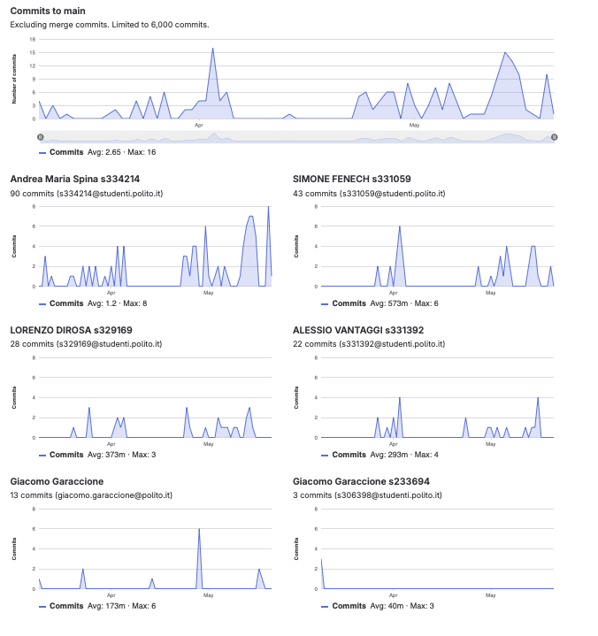

# Gruppo 20

## Valutazione deliverable V1

| gruppo | context diagram | business model | stakeholder | stories | interface | FR | NFR | use cases diagram | use cases | scenario | Glossary | DeploymentDiagram | functionality | estimation doc | precisione valori estimation | valutazione |
| --- | --- | --- | --- | --- | --- | --- | --- | --- | --- | --- | --- | --- | --- | --- | --- | --- |
| - | 1 | 0.5 | 0.5 | 1 | 1 | 3 | 3 | 1 | 5 | 5 | 5 | 2 | 1 | 2 | 2 | 33 |
| 20 | 95 | 100 | 95 | 90 | 95 | 95 | 90 | 95 | 100 | 100 | 95 | 100 | 90 | 85 | 71.67 | 95.65 |

## Valutazione deliverable V2

| gruppo | context diagram | business model | stakeholder | stories | interface | FR | NFR | ACCESS RIGHTS | use cases diagram | use cases | scenario | Glossary | DeploymentDiagram | functionality | estimation | precisione valori estimation | valutazione |
| --- | --- | --- | --- | --- | --- | --- | --- | --- | --- | --- | --- | --- | --- | --- | --- | --- | --- |
| - | 1 | 0.5 | 0.5 | 1 | 1 | 3 | 2 | 1 | 1 | 5 | 5 | 5 | 2 | 1 | 2 | 2 | 33 |
| 20 | 100 | 100 | 100 | 100 | 100 | 100 | 95 | 100 | 100 | 100 | 100 | 100 | 100 | 90 | 95 | 79.96 | 99.41 |

Le percentuali di v2 sono state riscalate in quanto la media pesata delle percentuali portava alcuni gruppi oltre al 100%.

## Valutazione codice e test (V2 + V3)

| Test Unit Totali | Test Unit Passati | Statement Coverage Unit | Branch Coverage Unit | Function Coverage Unit | Line Coverage Unit | Test Integration Totali | Test Integration Falliti | Statement Coverage Integration | Branch Coverage Integration | Function Coverage Integration | Line Coverage Integration | Correttezza V2 | Correttezza V3 | valutazione |
| --- | --- | --- | --- | --- | --- | --- | --- | --- | --- | --- | --- | --- | --- | --- |
| 1 | 0.5 | 2 | 2 | 1 | 1 | 1 | 0.5 | 2 | 2 | 1 | 1 | 16 | 2 | 33 |
| 75 | 100 | 100 | 100 | 100 | 100 | 100 | 100 | 100 | 50 | 100 | 100 | 78.9915966386555 | 100 | 86.03 |

 Unit e integration test prodotti dai gruppi sono stati eseguiti con la versione V2 del codice.

## Risultati Progetto

| Deliverable | Punteggio | Peso |
| --- | --- | --- |
| **Documenti V1** | 95.65% | 6 |
| **Documenti V2** | 98.08% | 2 |
| **Codice e Test** | 86.03% | 22 |
| **Timesheet** | 66.66% | 3 |
| **Valutazione** | 28.63 | 33 |
| **Valutazione** | 11.45 | 13.2 |

## Calcolo pesi progetto per singolo studente

| cognome | nome | email | gruppo | commit studente | commit totali | commit sul totale | coefficiente catme | coefficiente pesato | coefficiente progetto |
| --- | --- | --- | --- | --- | --- | --- | --- | --- | --- |
| DI ROSA | LORENZO | s329169@studenti.polito.it | 20 | 28 | 183 | 0.15 | 0.86 | 0.72 | 0.77 |
| FENECH | SIMONE | s331059@studenti.polito.it | 20 | 43 | 183 | 0.23 | 1.00 | 0.85 | 0.90 |
| SPINA | ANDREA MARIA | s334214@studenti.polito.it | 20 | 90 | 183 | 0.49 | 1.05 | 0.94 | 1.00 |
| VANTAGGI | ALESSIO | s331392@studenti.polito.it | 20 | 22 | 183 | 0.12 | 1.05 | 0.86 | 0.92 |

 I pesi del progetto sono ottenuti per l'80% dal valore calcolato da CATME e per il 20% dalla percentuale dei commit del singolo studente sul totale dei commit effettuati dagli studenti dello stesso gruppo. Il risultato è stato poi riscalato in modo che il punteggio più alto del gruppo ottenesse 1.

## Studenti

| Nome | Matricola | Email | Bonus | Voto Primo Appello | Voto Secondo Appello |  Progetto | Voto Finale |
| --- | --- | --- | --- | --- | --- | --- | --- |
| ANDREA MARIA SPINA | 334214 | s334214@studenti.polito.it | 1 | 15.92 | | 11.45 | 28 |
| SIMONE FENECH | 331059 | s331059@studenti.polito.it | 1 | 16.1 | | 10.34 | 27 |
| LORENZO DI ROSA | 329169 | s329169@studenti.polito.it | 1 | 15.7 | | 8.77 | 25 |
| ALESSIO VANTAGGI | 331392 | s331392@studenti.polito.it | 1 |  | 16.2 | 10.54 | 28 |
